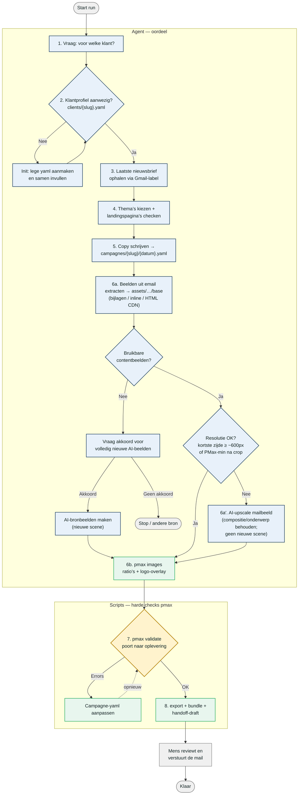

# PMax nieuwsbrief-pipeline — flowchart

Van de **laatste nieuwsbrief van een klant** naar reviewbaar Performance Max-materiaal.

**Kernregel:** bronbeelden komen standaard uit de email. Te lage resolutie → AI-upscale van datzelfde mailbeeld (compositie behouden). Volledig nieuwe AI-beelden alleen als er geen bruikbare mailbeelden zijn, en dan pas na expliciet akkoord.

## Wat doet wie?

| Stap | Wie | Wat |
|------|-----|-----|
| 1–2 | Agent | Klant vragen; profiel laden of `pmax init` |
| 3–5 | Agent | Mail lezen, thema’s + URL’s checken, copy in yaml |
| 6a | Agent | Beelden uit de mail (bijlagen / inline / HTML CDN) naar `assets/{slug}/base` |
| 6a′ | Agent | Te klein? AI-upscale van het **mailbeeld** (geen nieuwe scene) |
| 6b | Scripts | `pmax images` — crop/resize + logo |
| 7 | Scripts | `pmax validate` — tekenlimieten, counts, formaten |
| 8 | Scripts + mens | Bundle/export/draft; **mens** stuurt |

Agent en scripts praten via één bestand per run: `campagnes/{slug}/{datum}.yaml`.

## Hoe openen?

1. **In Cursor / VS Code:** open dit bestand en gebruik Mermaid-preview (bijv. extensie “Markdown Preview Mermaid Support”, of de ingebouwde preview als Mermaid aanstaat).
2. **Op GitHub:** push/open de file in de browser — GitHub rendert Mermaid in markdown automatisch.
3. **Online:** plak het blok tussen \`\`\`mermaid … \`\`\` op [mermaid.live](https://mermaid.live).
